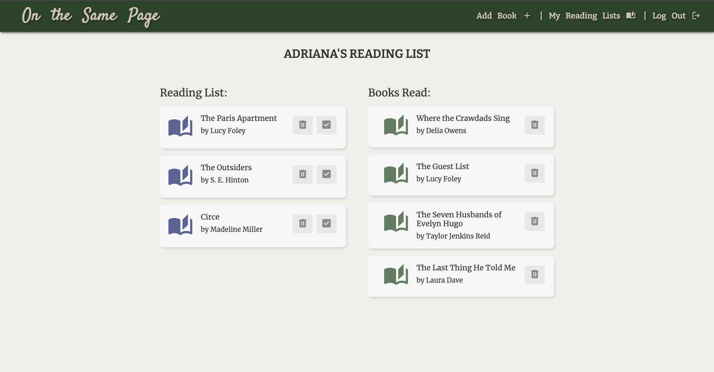

# On The Same Page

## Summary:

On the Same Page allows users to connect and discuss books on their own time. 
- You can view the current book of the month the club is reading, and a list of books other members recommend.

A logged in user can:
- Add a book to the recommended list for all to see.
- View each book's details and their respective reviews.
- Avilability to add, update, and delete your own book review.
- Book reviews added will update the average rating for that book.
- Add books from the recommended list and add them to your reading list.
- Once you are done reading the book you can add it to you already read list.
- Admin is the only one that can edit or delete a book that was added.

## Screenshots:

## Technologies Used:
- Python
- Django
- PostgreSQL
- Bootstrap
- HTML + CSS
- Heroku

## Getting Started:
- Heroku - https://on-the-same-page1.herokuapp.com/
- Trello Board - https://trello.com/b/h4zkJgZO/on-the-same-page
- Pitch-Deck - https://docs.google.com/presentation/d/1Hs2pQJmxe-sogJyz2wfEhXY5CLN3b7N6lhm_EbJENxc/edit?usp=sharing

## Next Steps
- Add ability to add book cover image when adding a book
- Filter the recommend list based on genre, author, book length, etc...
- Add ability for admin to select a book from the list as the book of the month.
- Add more specific instructions on how to navigate site

## Resources
- UserPassesTestMixin:
https://docs.djangoproject.com/en/4.2/topics/auth/default/

- Style form:
https://medium.com/swlh/how-to-style-your-django-forms-7e8463aae4fa
https://www.youtube.com/watch?v=6-XXvUENY_8

- Format decimals for ratings: 
https://www.djangotemplatetagsandfilters.com/filters/floatformat/

- Rating average method in Book model: 
https://medium.com/geekculture/django-implementing-star-rating-e1deff03bb1c#id_token=eyJhbGciOiJSUzI1NiIsImtpZCI6Ijk2OTcxODA4Nzk2ODI5YTk3MmU3OWE5ZDFhOWZmZjExY2Q2MWIxZTMiLCJ0eXAiOiJKV1QifQ.eyJpc3MiOiJodHRwczovL2FjY291bnRzLmdvb2dsZS5jb20iLCJuYmYiOjE2ODE4Mjc3OTQsImF1ZCI6IjIxNjI5NjAzNTgzNC1rMWs2cWUwNjBzMnRwMmEyamFtNGxqZGNtczAwc3R0Zy5hcHBzLmdvb2dsZXVzZXJjb250ZW50LmNvbSIsInN1YiI6IjExNTQzMjI0MTAwNTMzMDQ0Mzg5OCIsImVtYWlsIjoiYWRyaWNhc3RybzExOTZAZ21haWwuY29tIiwiZW1haWxfdmVyaWZpZWQiOnRydWUsImF6cCI6IjIxNjI5NjAzNTgzNC1rMWs2cWUwNjBzMnRwMmEyamFtNGxqZGNtczAwc3R0Zy5hcHBzLmdvb2dsZXVzZXJjb250ZW50LmNvbSIsIm5hbWUiOiJBZHJpYW5hIENhc3RybyIsInBpY3R1cmUiOiJodHRwczovL2xoMy5nb29nbGV1c2VyY29udGVudC5jb20vYS9BR05teXhacmMwSTZ3dWZ2NnhzQmFKWGEwN0xIQWktVFNZdlpfeUJJT1lDZUlBPXM5Ni1jIiwiZ2l2ZW5fbmFtZSI6IkFkcmlhbmEiLCJmYW1pbHlfbmFtZSI6IkNhc3RybyIsImlhdCI6MTY4MTgyODA5NCwiZXhwIjoxNjgxODMxNjk0LCJqdGkiOiJjNDQ5MmQwMmU1NTRlMDQ1ZTIyZWFiMGZhMmNkOGZkMzA4MDQxYzc4In0.cdVfHvzmt9YOyxewvb44h5ggDtj2B6tTTK7PdM4_JuKkFPI4ndGRPju6GRa2JAAuafeUSD1S4w-701qQMCznkwM3tUWXwUvI-5tKSHoAPfv491E60Jzm6oZQSdC0pU_9GiK_6k10p-d0jNQVRvaA0ntx6X_SIBtqXFzqlQ2Gx9jLY1fDBgQRXduSs_0PdxH54-KerTJMM3Xr8NJCZwNrs5zBx6A-e_YXBDAXYMs5_FDbCVlUa_n227V_-itPKax3xMQbPcJrEJ4-KyGKKdmVL2s-p0H9g0IFj3qE5XBN1muIsaLzSDHG49mzivIrrlJ22fupkqfol1fMzgxiPfJAxQ
